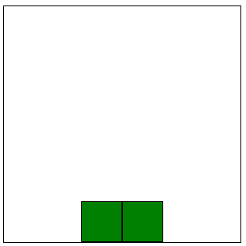
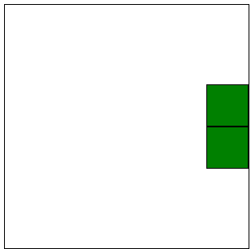
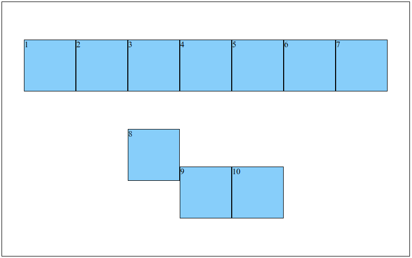
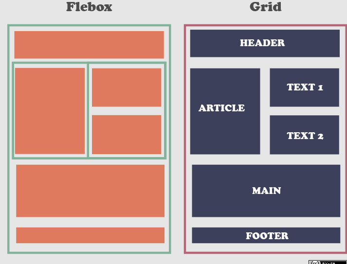

- [bloco vs elemento inline](#bloco-vs-elemento-inline)
  - [propriedade `display`](#propriedade-display)
- [centralizar horizontalmente elementos inline](#centralizar-horizontalmente-elementos-inline)
- [centralizar verticalmente um elemento inline](#centralizar-verticalmente-um-elemento-inline)
- [centralizar horizontalmente um elemento de tipo bloco](#centralizar-horizontalmente-um-elemento-de-tipo-bloco)
  - [usando `margin: auto 0`](#usando-margin-auto-0)
    - [o que é `margin: 0 auto`?](#o-que-é-margin-0-auto)
  - [usando flexbox](#usando-flexbox)
- [centralizar verticalmente um elemento de tipo bloco](#centralizar-verticalmente-um-elemento-de-tipo-bloco)
  - [`margin: auto 0` não funciona](#margin-auto-0-não-funciona)
  - [usando flexbox](#usando-flexbox-1)
  - [solução que era usada antes do flexbox](#solução-que-era-usada-antes-do-flexbox)
- [`flex-direction`](#flex-direction)
- [`flex-wrap`](#flex-wrap)
- [flexbox vs grid](#flexbox-vs-grid)

## bloco vs elemento inline

- todos os elementos em HTML podem ser dividos em 2 tipos:
  - **bloco**: aparece em uma nova linha, isto é, quando há múltiplos blocos cada um deles estará abaixo do elemento precedente e acima do elemento seguinte (é como se o navegador gerasse quebras de linha antes e depois do elemento); exemplos: `h1`, `p`, `div`...
  - **elementos inline**: ocupam somente a largura de seu conteúdo, isto é, quando há múltiplos elementos inline cada um deles estará à direita do elemento precedente e à esquerda do elemento seguinte; exemplos: `a`, `img`, `span`...

### propriedade `display`

- `display` igual a `block`, `table`, `flex` ou `grid` indica um bloco e igual a `inline`, `inline-block`, `inline-table`, `inline-flex` e `inline-grid` indica um elemento inline; detalhes:
  - os valores possíveis da propriedade `display` não são apenas `block` e `inline` porque essa propriedade definem 2 coisas: [display-outside](https://developer.mozilla.org/pt-BR/docs/Web/CSS/display-outside) (que define se o elemento é tratado como `block` ou `inline`) e [display-inside](https://developer.mozilla.org/pt-BR/docs/Web/CSS/display-inside) (que define o layout dos seus descendentes que pode ser `flow`, `flow-root`, `table`, `flex`, `grid`)
  - o `display-inside` padrão tanto do `block` quanto do `inline` é `flow` (então, `block` é equivalente a `block-flow`); quando o display-outside é omitido ele é do tipo `block` (`table`, `flex` e `grid`) e quando é to tipo `inline` ele é explicíto (`inline-block`, `inline-table`, `inline-flex` e `inline-grid`)

## centralizar horizontalmente elementos inline

- use **`text-align: center`** para centralizar horizontalmente elementos inline

```html
<style>
  div {
    border: 1px solid #000;
    height: 500px;

    text-align: center;
  }
</style>
<body>
  <div>
    
  </div>
</body>
```

- essa mesma propriedade pode ser usada para alinhar **contéudo textual** dentro de elementos bloco (note que o alinhamento não ocorre no bloco em si, somente no seu conteúdo)

```html
<style>
  h1 {
    background-color: pink;
    width: 50%;

    text-align: center;
  }
</style>
<body>
  <h1>Olá, mundo!</h1>
</body>
```

## centralizar verticalmente um elemento inline

- existe uma propriedade denominada [`vertical-align`](https://developer.mozilla.org/pt-BR/docs/Web/CSS/vertical-align) mas ela é usada para alinhar o conteúdo dentro de sua linha e não em relação ao elemento bloco ao qual o elemento inline pertence para isso usamos **flexbox**

```html
<style>
  div {
    border: 1px solid #000;
    height: 500px;

    display: flex;
    align-items: center;
  }
</style>
<body>
  <div>
    
  </div>
</body>
```

## centralizar horizontalmente um elemento de tipo bloco

- `text-align: center` não funciona para alinhar elementos do tipo bloco
- ao invés, use um dos 2 métodos abaixo eles são **equivalentes** em maior parte dos casos

### usando `margin: auto 0`

```html
<style>
  #pai {
    border: 1px solid #000;
    height: 500px;
  }

  #filho {
    width: 100px;
    height: 100px;
    background-color: green;

    margin: 0 auto;
  }
</style>
<body>
  <div id="pai">
    <div id="filho"></div>
  </div>
</body>
```

#### o que é `margin: 0 auto`?

- a propriedade `margin` (e também a `padding`) possui variações ao que diz respeito à **quantidade de argumentos**
  - **1 argumento** (por exemplo, `margin: 8px`) — adiciona margem de 8px em todos os lados
  - **4 argumentos** (por exemplo, `margin: 6px 12px 8px 10px`) - individualmente adiciona margens para cada um dos lados em sentido horário (superior, direito, inferior, esquerdo)
  - **2 argumentos** (por exemplo, `margin: auto 0`) — o primeiro valor é para os lados superior e inferior e o segundo valor para os lados direito e esquerdo
- como o valor **`auto`** funciona?
  - usar apenas `margin-right: auto` deslocaria a div filha para a extrema esquerda (não haveria espaço entre a borda esquerda da div filha e a borda esquerda da div pai)
  - usar apenas `margin-left: auto` deslocaria a div filha para a extrema direita (não haveria espaço entre a borda direita da div filha e a borda direita da div pai)
  - usar o valor `auto` para ambas as propriedades instrui o browser a distribuir igualmente o tamanho das margens direita e esquerda

### usando flexbox

```html
<style>
  #pai {
    border: 1px solid #000;
    height: 500px;
    
    display: flex;
    justify-content: center;
  }

  #filho {
    width: 100px;
    height: 100px;
    background-color: green;
  }
</style>
<body>
  <div id="pai">
    <div id="filho"></div>
  </div>
</body>
```

## centralizar verticalmente um elemento de tipo bloco

### `margin: auto 0` não funciona

- se `margin: 0 auto` é usado para centralizar horizontalmente, é de se esperar que `margin: auto 0` possa ser usado para centralizar verticalmente; no entanto, esse não é o caso
- a [especificação do CSS](http://www.w3.org/TR/CSS2/visudet.html#Computing_heights_and_margins) define que o valor `auto` para `margin-top` e `margin-bottom` é equivalente a zero

### usando flexbox

```html
<style>
  #pai {
    border: 1px solid #000;
    height: 500px;

    display: flex;
    align-items: center;
  }

  #filho {
    width: 100px;
    height: 100px;
    background-color: green;
  }
</style>
<body>
  <div id="pai">
    <div id="filho"></div>
  </div>
</body>
```

### solução que era usada antes do flexbox

- **apenas a título de conhecimento**; prefira usar a solução com flexbox pois é mais clara e concisa
- antes da introdução e adoção do flexbox, o método usado para centralizar verticalmente um elemento de altura não conhecida previamente usava `position: relative`, `top` e `translateY`

```html
<style>
  #pai {
    border: 1px solid #000;
    height: 100%;
  }

  #filho {
    width: 100px;
    height: 25%;
    background-color: green;

    position: relative; /* necessária para usar a propriedade top */
    top: 50%; /* desce a div filha em relação ao tamanho da div pai */
    transform: translateY(-50%); /* sobe a div filha em relação ao tamanho dela própia */
  }
</style>
<body>
  <div id="pai">
    <div id="filho"></div>
  </div>
</body>
```

## `flex-direction`

- levando em consideração os exemplos acima, pode-se concluir erroneamente que `justfify-content` é usado para alinhamento horizontal e `align-items` para alinhamento vertical, mas esse não é sempre o caso
- `justify-content` é usado para definir a distribuição de espaço no **eixo principal** e `align-items` é usado para definir a distribuição de espaço no **eixo transversal** (eixo perpendicular ao eixo principal)
- qual é o eixo principal depende da propriedade **`flex-direction`** que pode ter os valores `row` (padrão) e `column`
- quando **`flex-direction: row`**, múltiplos descendentes serão dispostos horizontalmente (isso é, um ao lado do outro); nesse caso, o eixo principal é o eixo x e o eixo perpendicular é o eixo y

```html
<style>
  #pai {
    border: 1px solid #000;
    width: 300px;
    height: 300px;
  
    display: flex;
    flex-direction: row; /* desnecessário pois row já é o valor padrão*/
    justify-content: center; /* alinhamento horizontal */
    align-items: end; /* alinhamento vertical */
  }

  .filhos {
    width: 50px;
    height: 50px;
    background-color: green;
    border: 1px solid #000;
  }
</style>
<body>
  <div id="pai">
    <div class="filhos"></div>
    <div class="filhos"></div>
  </div>
</body>
```



- quando **`flex-direction: column`**, múltiplos descendentes serão dispostos verticalmente (isso é, um abaixo do outro); nesse caso, o eixo principal é o eixo y e o eixo perpendicular o eixo x

```html
<style>
  #pai {
    border: 1px solid #000;
    width: 300px;
    height: 300px;
  
    display: flex;
    flex-direction: column;
    justify-content: center; /* alinhamento vertical */
    align-items: end; /* alinhamento horizontal */
  }

  .filhos {
    width: 50px;
    height: 50px;
    background-color: green;
    border: 1px solid #000;
  }
</style>
<body>
  <div id="pai">
    <div class="filhos"></div>
    <div class="filhos"></div>
  </div>
</body>
```



## `flex-wrap`

```html
<style>
  #pai {
    width: 800px;
    height: 500px;
    border: 1px solid #000;

    display: flex;
    flex-wrap: wrap; /* permite que elemento seja quebrado em múltiplas linhas se necessário */
    justify-content: center;
    align-items: center;
  }

  .filho {
    width: 100px;
    height: 100px;
    background-color: lightskyblue;
    border: 1px solid black;
  }

  .filho:nth-child(8) {
    align-self: start; /* sobreescreve o valor de align-items */
  }
</style>
<body>
  <div id="pai">
    <div class="filho">1</div>
    <div class="filho">2</div>
    <div class="filho">3</div>
    <div class="filho">4</div>
    <div class="filho">5</div>
    <div class="filho">6</div>
    <div class="filho">7</div>
    <div class="filho">8</div>
    <div class="filho">9</div>
    <div class="filho">10</div>
  </div>
</body>
```



## flexbox vs grid


